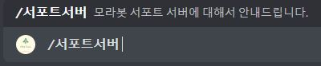
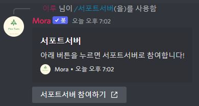

# 서포트 서버에 참여하기

모라봇의 명령어는 대부분 슬래쉬(/) 명령어로 제작되어 있습니다.

> 명령어 : /서포트서버

모라봇 도움말 명령어는 모라봇의 모든 명령어를 확인할수 있습니다.

<figure><figcaption>서포트서버 명령어 입니다.</figcaption></figure>
<figure><figcaption>서포트서버에 참여할수 있는 버튼입니다. 해당 버튼을 누르면</figcaption></figure>
