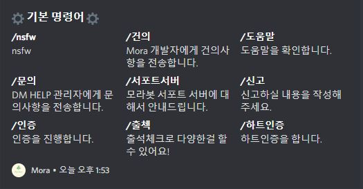
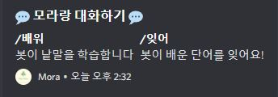
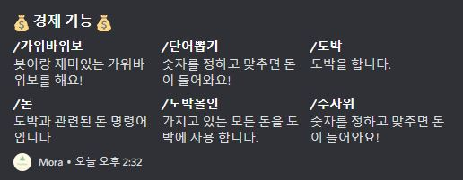
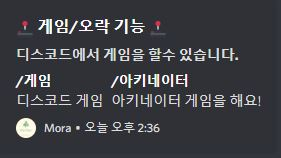
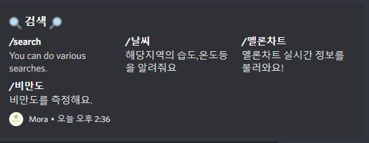
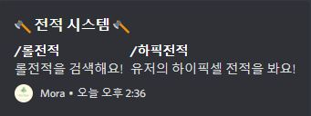
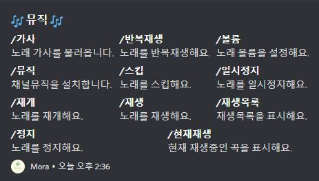
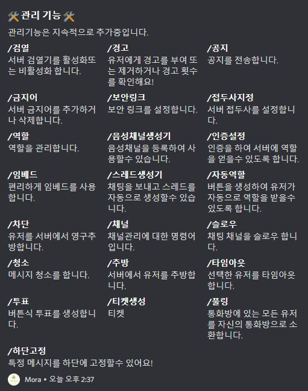

# 도움말

모라봇의 명령어는 대부분 슬래쉬(/) 명령어로 제작되어 있습니다.

> 명령어 : /도움말

모라봇 도움말 명령어는 모라봇의 모든 명령어를 확인할수 있습니다.

<figure><figcaption>기본기능</figcaption></figure>
<figure><figcaption>대화기능</figcaption></figure>
<figure><figcaption>경제기능</figcaption></figure>
<figure><figcaption>오락기능</figcaption></figure>
<figure><figcaption>검색기능</figcaption></figure>
<figure><figcaption>전적기능</figcaption></figure>
<figure><figcaption>뮤직기능</figcaption></figure>
<figure><figcaption>유틸리티</figcaption></figure>
<figure><figcaption>관리기능</figcaption></figure>
